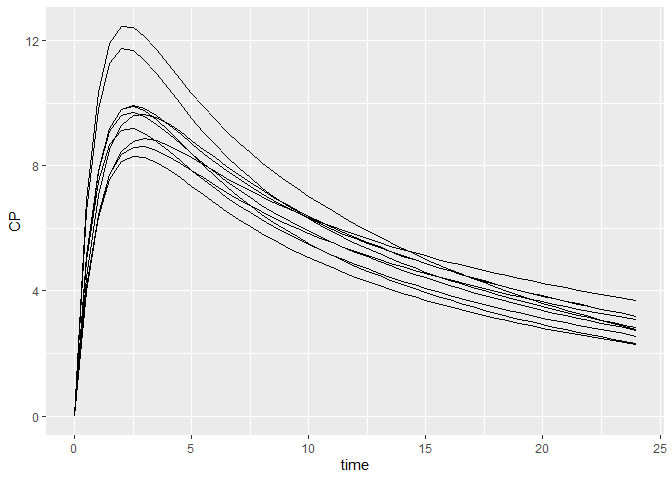

# pmxtran

A library dedicate to drug model conversion in pharmacometrics.

## Requirements

-   Python framework and Pharmpy package must be installed beforehand
-   R packages pmxmod must also be installed

## Installation

Install the current development version:

``` r
devtools::install_github("Calvagone/campsistrans", ref="main", auth_token="AUTH_TOKEN", force=TRUE)
```

## Some examples

### Import NONMEM control stream

First import the `campsistrans` package:

``` r
library(campsistrans)
```

Let’s have a quick look at the NONMEM control stream we’re going to
import:

``` r
cat(readLines("data-raw/advan4_trans4"), sep = "\n")
```

    $PROBLEM 2-compartment model
    $INPUT
    $DATA dataset.csv IGNORE=I
    $SUBROUTINE ADVAN4 TRANS4
    $PK
     KA = THETA(1) * EXP(ETA(1))
     CL = THETA(2) * EXP(ETA(2))
     V2 = THETA(3) * EXP(ETA(3))
     V3 = THETA(4) * EXP(ETA(4))
     Q = THETA(5) * EXP(ETA(5))
     S2 = V2
    $ERROR 
     CP = F
     OBS_CP = CP *(1+EPS(1))
     Y = OBS_CP
    $THETA 1     ; KA 
    $THETA 5     ; CL 
    $THETA 80    ; V2 
    $THETA 20    ; V3 
    $THETA 4     ; Q
    $OMEGA 0.025 ; KA
    $OMEGA 0.025 ; CL
    $OMEGA 0.025 ; V2
    $OMEGA 0.025 ; V3
    $OMEGA 0.025 ; Q
    $SIGMA 0.025 ; PROP

Let’s name our model parameters first by defining a mapping object.

``` r
mapping <- mapping(
    theta = c(KA=1, CL=2, V2=3, V3=4, Q=5),
    omega = c(KA=1, CL=2, V2=3, V3=4, Q=5),
    sigma = c(PROP=1))
```

Let’s then import this model using `pmxtran`. By default, the initial
values are used as reference values in the model.

``` r
pmxtran <- importNONMEM("data-raw/advan4_trans4", mapping, estimate=FALSE)
```

Convert this object to a PMX model:

``` r
model <- pmxtran %>% export(dest="pmxmod")
show(model)
```

    ## [MAIN]
    ## KA=THETA_KA*exp(ETA_KA)
    ## CL=THETA_CL*exp(ETA_CL)
    ## V2=THETA_V2*exp(ETA_V2)
    ## V3=THETA_V3*exp(ETA_V3)
    ## Q=THETA_Q*exp(ETA_Q)
    ## S2=V2
    ## 
    ## [ODE]
    ## d/dt(A_DEPOT)=-KA*A_DEPOT
    ## d/dt(A_CENTRAL)=KA*A_DEPOT + Q*A_PERIPHERAL/V3 + (-CL/V2 - Q/V2)*A_CENTRAL
    ## d/dt(A_PERIPHERAL)=-Q*A_PERIPHERAL/V3 + Q*A_CENTRAL/V2
    ## d/dt(A_OUTPUT)=CL*A_CENTRAL/V2
    ## F=A_CENTRAL/S2
    ## 
    ## [ERROR]
    ## CP=F
    ## OBS_CP=CP*(EPS_PROP + 1)
    ## Y=OBS_CP
    ## 
    ## 
    ## THETA's:
    ##   name index value   fix
    ## 1   KA     1     1 FALSE
    ## 2   CL     2     5 FALSE
    ## 3   V2     3    80 FALSE
    ## 4   V3     4    20 FALSE
    ## 5    Q     5     4 FALSE
    ## OMEGA's:
    ##   name index index2 value   fix type same
    ## 1   KA     1      1 0.025 FALSE  var   NA
    ## 2   CL     2      2 0.025 FALSE  var   NA
    ## 3   V2     3      3 0.025 FALSE  var   NA
    ## 4   V3     4      4 0.025 FALSE  var   NA
    ## 5    Q     5      5 0.025 FALSE  var   NA
    ## SIGMA's:
    ##   name index index2 value   fix type
    ## 1 PROP     1      1 0.025 FALSE  var
    ## No variance-covariance matrix
    ## 
    ## Compartments:
    ## A_DEPOT (CMT=1)
    ## A_CENTRAL (CMT=2)
    ## A_PERIPHERAL (CMT=3)
    ## A_OUTPUT (CMT=4)

Simulate it using CAMPSIS:

``` r
library(campsis)
```

    ## 
    ## Attachement du package : 'campsis'

    ## L'objet suivant est masqué depuis 'package:stats':
    ## 
    ##     simulate

    ## L'objet suivant est masqué depuis 'package:base':
    ## 
    ##     sample

``` r
dataset <- Dataset(10)
dataset <- dataset %>% add(Bolus(time=0, amount=1000))
dataset <- dataset %>% add(Observations(times=seq(0,24, by=0.5)))

results <- simulate(model, dataset, dest="RxODE", seed=1)
spaghettiPlot(results, "CP")
```

<!-- -->
