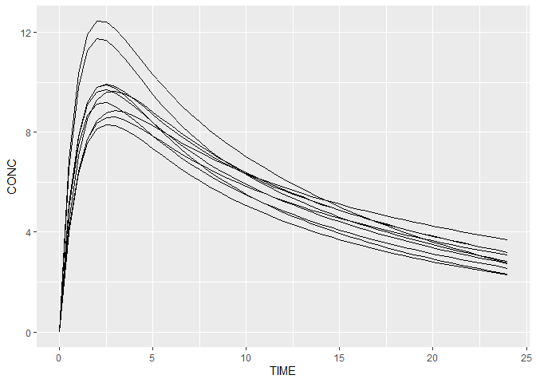

# campsistrans

A library dedicate to drug model conversion in pharmacometrics.

## Installation

Install the latest version:

``` r
devtools::install_github("Calvagone/campsistrans")
```

## Some examples

First import the `campsistrans` package:

``` r
library(campsistrans)
```

Let’s have a quick look at the NONMEM control stream we’re going to
import:

``` r
path <- getNONMEMModelTemplate(4,4)
cat(readLines(con=file(path)), sep="\n")
```

    $PROBLEM 2-compartment model
    $DATA dataset.csv IGNORE=I
    $SUBROUTINE ADVAN4 TRANS4
    $PK
     KA = THETA(1) * EXP(ETA(1))
     CL = THETA(2) * EXP(ETA(2))
     V2 = THETA(3) * EXP(ETA(3))
     V3 = THETA(4) * EXP(ETA(4))
     Q = THETA(5) * EXP(ETA(5))
     S2 = V2
    $ERROR 
     CONC = F
     CONC_ERR = CONC *(1+EPS(1))
     Y = CONC_ERR
    $THETA 1     ; KA 
    $THETA 5     ; CL 
    $THETA 80    ; V2 
    $THETA 20    ; V3 
    $THETA 4     ; Q
    $OMEGA 0.025 ; KA
    $OMEGA 0.025 ; CL
    $OMEGA 0.025 ; V2
    $OMEGA 0.025 ; V3
    $OMEGA 0.025 ; Q
    $SIGMA 0.025 ; PROP
    $SIMULATION (1234) ONLYSIM NSUB=1
    $TABLE ID TIME EVID MDV DV AMT CMT CP FILE=output.tab ONEHEADER NOAPPEND NOPRINT

### Import NONMEM control stream (Pharmpy)

Let’s import this model using `campsistrans` with `Pharmpy` (config.yml
file is needed with the path to Python). By default, the initial values
are used as reference values in the model.

``` r
object <- importNONMEM(file=path, mapping=mapping(auto=TRUE), estimate=FALSE)
```

Convert this object to a Campsis model:

``` r
model <- object %>% export(dest="campsis")
show(model)
```

    ## [MAIN]
    ## KA=THETA_KA*exp(ETA_KA)
    ## CL=THETA_CL*exp(ETA_CL)
    ## V2=THETA_V2*exp(ETA_V2)
    ## V3=THETA_V3*exp(ETA_V3)
    ## Q=THETA_Q*exp(ETA_Q)
    ## S2=V2
    ## 
    ## [ODE]
    ## d/dt(A_DEPOT)=-KA*A_DEPOT
    ## d/dt(A_CENTRAL)=KA*A_DEPOT + Q*A_PERIPHERAL/V3 + (-CL/V2 - Q/V2)*A_CENTRAL
    ## d/dt(A_PERIPHERAL)=-Q*A_PERIPHERAL/V3 + Q*A_CENTRAL/V2
    ## F=A_CENTRAL/S2
    ## 
    ## [ERROR]
    ## CONC=F
    ## CONC_ERR=CONC*(EPS_RSV + 1)
    ## Y=CONC_ERR
    ## 
    ## 
    ## THETA's:
    ##   name index value   fix
    ## 1   KA     1     1 FALSE
    ## 2   CL     2     5 FALSE
    ## 3   V2     3    80 FALSE
    ## 4   V3     4    20 FALSE
    ## 5    Q     5     4 FALSE
    ## OMEGA's:
    ##   name index index2 value   fix type
    ## 1   KA     1      1 0.025 FALSE  var
    ## 2   CL     2      2 0.025 FALSE  var
    ## 3   V2     3      3 0.025 FALSE  var
    ## 4   V3     4      4 0.025 FALSE  var
    ## 5    Q     5      5 0.025 FALSE  var
    ## SIGMA's:
    ##   name index index2 value   fix type
    ## 1  RSV     1      1 0.025 FALSE  var
    ## No variance-covariance matrix
    ## 
    ## Compartments:
    ## A_DEPOT (CMT=1)
    ## A_CENTRAL (CMT=2)
    ## A_PERIPHERAL (CMT=3)

Simulate it using Campsis:

``` r
library(campsis)
dataset <- Dataset(10) %>%
  add(Bolus(time=0, amount=1000, compartment="DEPOT")) %>%
  add(Observations(times=seq(0,24, by=0.5)))

results <- simulate(model, dataset, dest="rxode2", seed=1)
spaghettiPlot(results, "CONC")
```

<!-- -->

### Import NONMEM control stream (nonmem2rx)

The same model can also be imported with `nonmem2rx`, which does not
need Python to work.

``` r
object <- importNONMEM2(ctlFile=path)
```

Convert this object to a Campsis model:

``` r
model <- object %>% export(dest="campsis")
show(model)
```

    ## [MAIN]
    ## KA=THETA_KA * exp(ETA_KA)
    ## CL=THETA_CL * exp(ETA_CL)
    ## V2=THETA_V2 * exp(ETA_V2)
    ## V3=THETA_V3 * exp(ETA_V3)
    ## Q=THETA_Q * exp(ETA_Q)
    ## SCALE2=V2
    ## 
    ## [ODE]
    ## d/dt(A_DEPOT)=-KA*A_DEPOT
    ## d/dt(A_CENTRAL)=KA*A_DEPOT + Q*A_PERIPHERAL/V3 + (-CL/V2 - Q/V2)*A_CENTRAL
    ## d/dt(A_PERIPHERAL)=-Q*A_PERIPHERAL/V3 + Q*A_CENTRAL/V2
    ## d/dt(A_OUTPUT)=CL*A_CENTRAL/V2
    ## F=A_CENTRAL/SCALE2
    ## 
    ## [ERROR]
    ## CONC=F
    ## CONC_ERR=CONC * (1 + EPS_RUV1)
    ## Y=CONC_ERR
    ## 
    ## 
    ## THETA's:
    ##   name index value   fix
    ## 1   KA     1     1 FALSE
    ## 2   CL     2     5 FALSE
    ## 3   V2     3    80 FALSE
    ## 4   V3     4    20 FALSE
    ## 5    Q     5     4 FALSE
    ## OMEGA's:
    ##   name index index2 value   fix type
    ## 1   KA     1      1 0.025 FALSE  var
    ## 2   CL     2      2 0.025 FALSE  var
    ## 3   V2     3      3 0.025 FALSE  var
    ## 4   V3     4      4 0.025 FALSE  var
    ## 5    Q     5      5 0.025 FALSE  var
    ## SIGMA's:
    ##   name index index2 value   fix type
    ## 1 RUV1     1      1 0.025 FALSE  var
    ## No variance-covariance matrix
    ## 
    ## Compartments:
    ## A_DEPOT (CMT=1)
    ## A_CENTRAL (CMT=2)
    ## A_PERIPHERAL (CMT=3)
    ## A_OUTPUT (CMT=4)

Simulate it using Campsis:

``` r
library(campsis)
dataset <- Dataset(10) %>%
  add(Bolus(time=0, amount=1000, compartment="DEPOT")) %>%
  add(Observations(times=seq(0,24, by=0.5)))

results <- simulate(model, dataset, dest="rxode2", seed=1)
spaghettiPlot(results, "CONC")
```

<!-- -->
